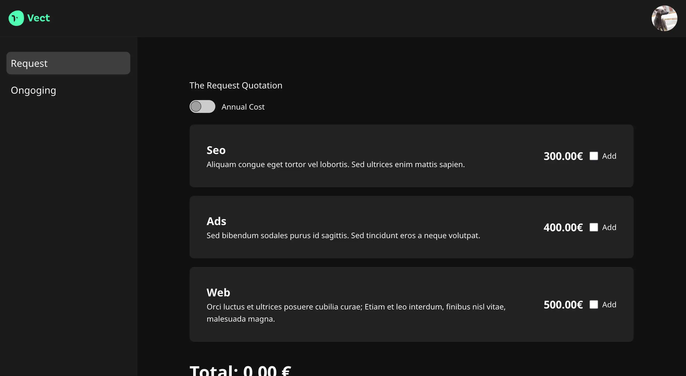

# Sprint 6 IT Academy | Quotation and filters using React

## Description

Sprint 6



### Some decisions

-   Use Vite and Vitest as development tools.
-   Include React Router.
-   The data enters through the pages component.

## Technologies

-   JavaScript.
-   Vite.
-   Vitest.
-   Taildwind.

## Requirements

-   Node.js v23.9.0
-   npm v11.2.0

## Documentation

### Installation

1. Clone this repo

```bash
$ git clone  .
```

2. Install packages

```bash
$ npm install
```

3. Run develop

```bash
$ npm run dev
```

## Future Improvements

-   Add tests.
-   Save local data on `localStore` and `sessionStore`

## Contributing

### Code of Conduct

Studio Moare has adopted the Contributor Covenant Code of Conduct that we expect project participants to adhere to. [Please read the full text](https://www.contributor-covenant.org/version/2/1/code_of_conduct/code_of_conduct.md) so that you can understand what actions will and will not be tolerated.
